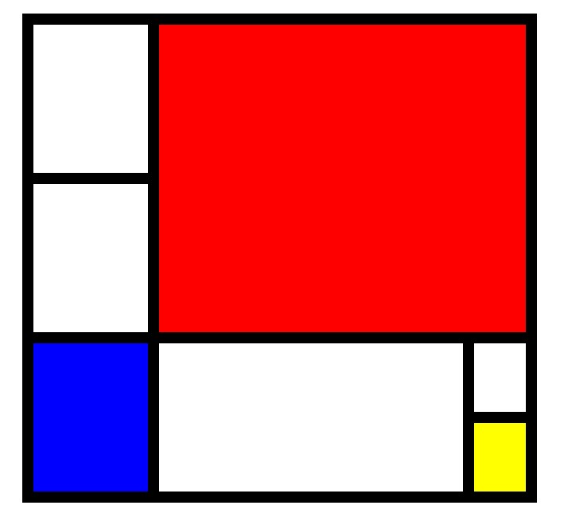

# CSS Recreation of Piet Mondrian's "Composition with Red, Blue, and Yellow"

This project is **my attempt to create a CSS and HTML implementation of Piet Mondrian's "Composition with Red, Blue, and Yellow,"** a 1930 painting by the Dutch artist who was a leading figure in the Neo-Plasticism movement. The artwork is characterized by its thick, black brushwork defining the borders of colored rectangles. As the title suggests, the only colors used in the painting besides black and white are red, blue, and yellow.

Mondrian composed this painting as a harmony of contrasts that signifies both balance and the tension of dynamic force. The CSS and HTML implementation of the artwork attempts to reflect this harmony through the use of **CSS grid** and HTML elements. **The design is responsive and adapts to different screen sizes.**

## Implementation

The CSS implementation uses the grid layout to position the colored rectangles on the page. The HTML structure is composed of div elements that represent each colored rectangle.
